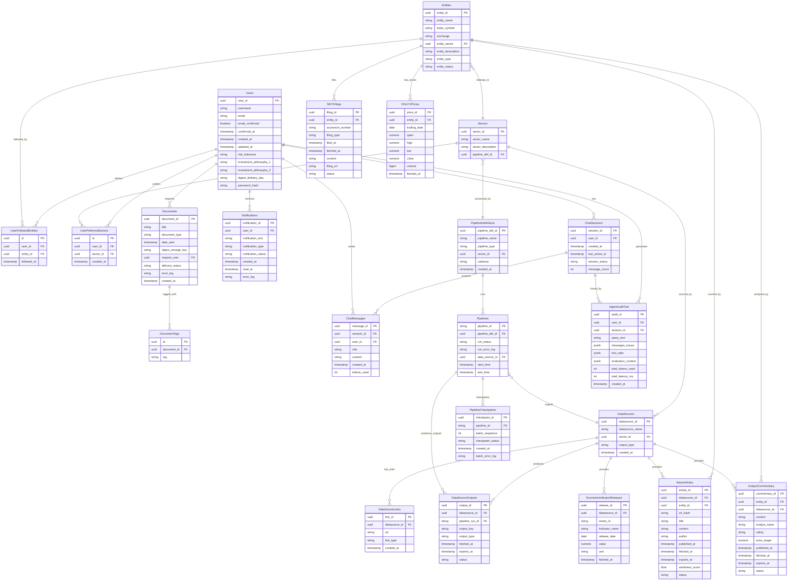

# PostgreSQL Database Schema — ERD
## Financial Intelligence Multi-Agent System

**Version:** 0.2.0  
**Status:** Draft  
**Last Updated:** 2026-05-01

---

---

## Table Descriptions

| Table | Purpose |
|---|---|
| Users | User accounts, authentication, preferences, risk appetite, philosophy profile |
| Sectors | US market sectors — technology, energy, healthcare etc. |
| Entities | US-listed companies, indices, economic indicators |
| UserFollowedEntities | Junction table — which users follow which entities |
| UserPreferredSectors | Junction table — which users prefer which sectors |
| Documents | Unified table for reports and digests, discriminated by document_type |
| DocumentTags | Tags associated with documents |
| Notifications | In-app notification history per user |
| ChatSessions | Stateful chat session containers per user |
| ChatMessages | Individual messages within a chat session |
| DataSources | External data providers (NewsAPI, FRED, EDGAR etc.) |
| DataSourceLinks | API endpoints and documentation URLs per data source |
| DataSourceOutputs | Individual output files produced per pipeline run per data source |
| PipelineDefinitions | Pipeline definitions — what a pipeline is and its cadence |
| Pipelines | Individual pipeline run records with Snowflake IDs |
| PipelineCheckpoints | Micro-batch checkpoints for crash recovery |
| AgentAuditTrail | Full reasoning traces per agent interaction |
| NewsArticles | Ingested news articles within 90-day retention window |
| SECFilings | SEC filings via EDGAR — permanent retention |
| OHLCVPrices | Daily market prices — permanent retention |
| EconomicIndicatorReleases | FRED economic indicator releases — permanent retention |
| AnalystCommentary | Analyst commentary within 90-day retention window |

---

## Key Constraints

| Table | Unique Constraint | Purpose |
|---|---|---|
| NewsArticles | url_hash | Idempotent ingestion deduplication |
| SECFilings | accession_number | EDGAR natural deduplication key |
| OHLCVPrices | entity_id + trading_date | One price record per entity per day |
| EconomicIndicatorReleases | series_id + release_date | One release per indicator per date |
| UserFollowedEntities | user_id + entity_id | Prevent duplicate follows |
| UserPreferredSectors | user_id + sector_id | Prevent duplicate sector preferences |

---

## Pipeline Design Note

`PipelineDefinitions` separates **what a pipeline is** from **a specific execution of it**:

- `PipelineDefinitions` — defines the pipeline: its name, type, cadence, and which sector it serves. One record per pipeline type per sector. Static, rarely changes.
- `Pipelines` — records each individual run of a pipeline definition. One record per execution with its own Snowflake ID, status, start/end times, and error log.

This means a sector has a FK to `PipelineDefinitions` (its dedicated pipeline) while `Pipelines` accumulates run history over time without polluting the sector record.
